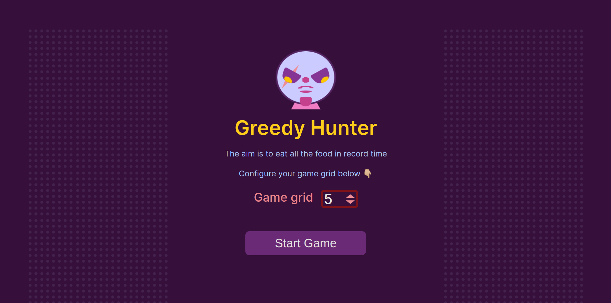

# Greedy Hunter Game
This is an interactive game displayed on a grid. The number of rows and columns in the grid system is dependent on the user's preference. It was built with HTML, CSS, JS, and React.
## Built With

- HTML
- CSS
- JavaScript
- React

## Live Demo

[Live Demo Link](https://henrykc24.github.io/greedy-hunter-game/)

## Author

👤 **Henry Kc**

- GitHub: [@githubhandle](https://github.com/henrykc24)
- Twitter: [@twitterhandle](https://twitter.com/henrykc24)
- LinkedIn: [LinkedIn](https://linkedin.com/in/henry-kc)

## 🤝 Contributing

Contributions, issues, and feature requests are welcome!

Feel free to check the [issues page](https://github.com/HENRYKC24/greedy-hunter-game/issues/).

## Show your support

Give a ⭐️ if you like this project!

## Acknowledgments
- I am thankful to all my fellow developers whom I reach out to whenever I have a blocker.
## 📝 License

This project is [MIT](./LICENSE) licensed.
